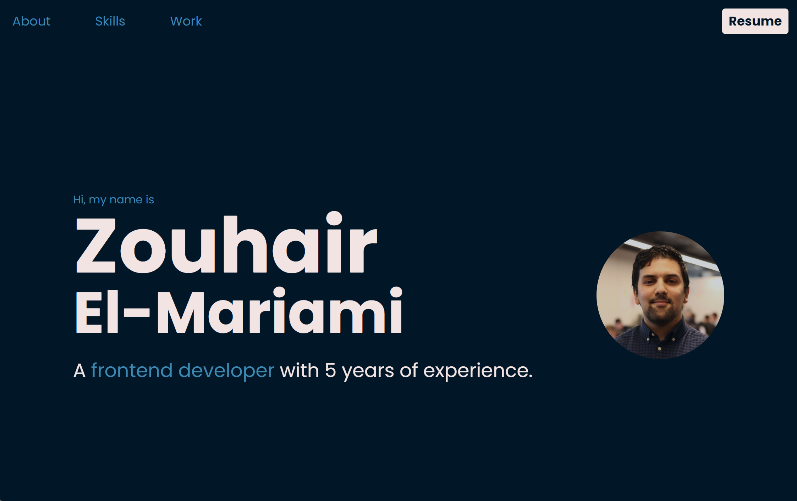

# CMS Portfolio

This is a personal [portfolio](https://zouhair.netlify.app) developed so that I can showcase some of my past and future projects as a frontend developer. I decided to build it using **Nuxt.JS**, a static site generator framework built on top of Vue.JS.  

It seemed best to build a CMS instead of a standard SPA for quick and easy updates to my portfolio, whenever I can publish a new project, learned a new skill or updated my CV.

The UI library I used was **Tailwind CSS**. This is because I had greater level of customization than if I were to use other libraries such as Bootstrap. 

## Netlify CMS

The content gets created/updated using markdown files, pushed from the Netlify CMS into the Github repo. That triggers a web hook that automatically creates and deploys a new build of the portfolio. The portfolio fetches that content and iterates over it. 

_The Netlify CMS for my portfolio looks like this_

    

